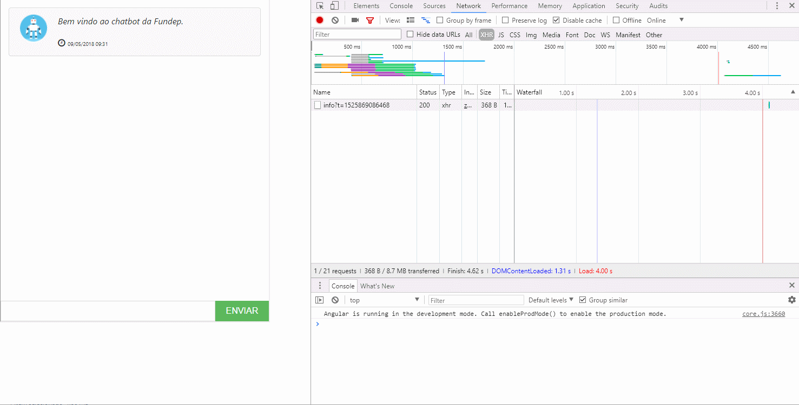
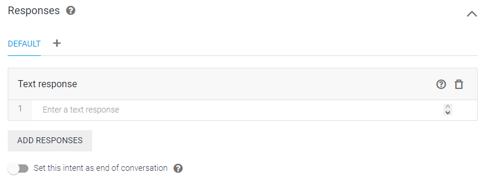
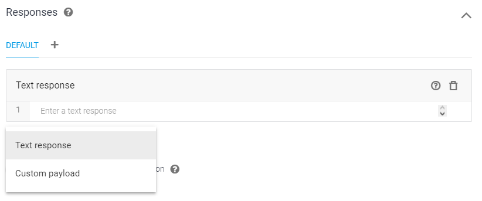
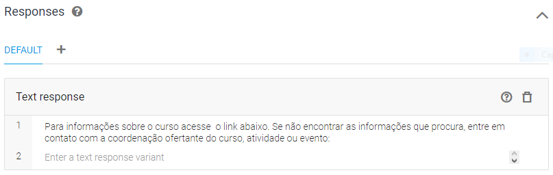
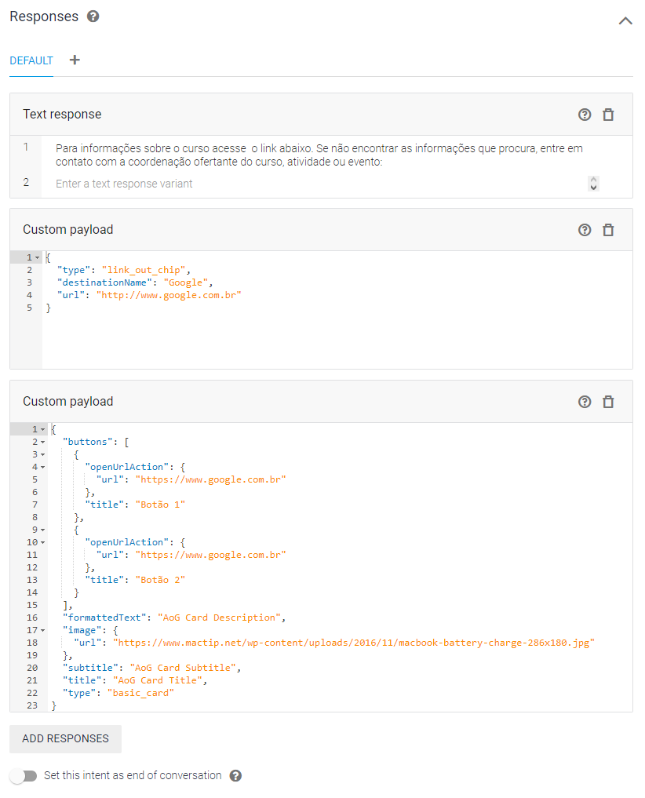

# Documentação

Webclient para Dialogflow baseado no tutorial [Chatbot with Angular 5 & DialogFlow](http://www.blog.labouardy.com/chatbot-with-angular-5-dialogflow/).

<p align="center">
  
</p>

## Como disponibilizar o cliente em diversas aplicações

Para disponibilização o cliente é necessário incluir o chatbot em uma página através de um iframe. Desta forma, o chatbot pode funcionar em qualquer aplicação de qualquer tecnologia.

Na concepção do cliente, foi definido também o requisito de se poder enviar para o Dialogflow informações, por exemplo o nome do usuário logado.

Para isso, foi implementado no cliente a escuta ao evento 'message', utilizado para envio de informações entre a janela pai e a janela filha (iframe).

Deste modo, segue um exemplo de como disponibilizar a janela do cliente em uma aplicação, e de como realizar o binding ao evento 'message' nessa aplicação:

> O código abaixo encontra-se no repositório, no arquivo demo.html

```

<!doctype html>
<html lang="pt-BR">
    <head>
        <meta charset="utf-8">
        <title>Uma página qualquer...</title>
        <base href="/">
        <meta name="viewport" content="width=device-width, initial-scale=1">
        <link rel="stylesheet" href="https://maxcdn.bootstrapcdn.com/bootstrap/4.0.0-alpha.6/css/bootstrap.min.css" integrity="sha384-rwoIResjU2yc3z8GV/NPeZWAv56rSmLldC3R/AZzGRnGxQQKnKkoFVhFQhNUwEyJ" crossorigin="anonymous">
        <link rel="stylesheet" href="https://maxcdn.bootstrapcdn.com/font-awesome/4.7.0/css/font-awesome.min.css">
    </head>
    <body>
        <iframe id="bot-fundep" src="http://localhost:4200" width="500" height="600"></iframe>
        <script src="https://code.jquery.com/jquery-3.1.1.slim.min.js" integrity="sha384-A7FZj7v+d/sdmMqp/nOQwliLvUsJfDHW+k9Omg/a/EheAdgtzNs3hpfag6Ed950n" crossorigin="anonymous"></script>
        <script src="https://cdnjs.cloudflare.com/ajax/libs/tether/1.4.0/js/tether.min.js" integrity="sha384-DztdAPBWPRXSA/3eYEEUWrWCy7G5KFbe8fFjk5JAIxUYHKkDx6Qin1DkWx51bBrb" crossorigin="anonymous"></script>
        <script src="https://maxcdn.bootstrapcdn.com/bootstrap/4.0.0-alpha.6/js/bootstrap.min.js" integrity="sha384-vBWWzlZJ8ea9aCX4pEW3rVHjgjt7zpkNpZk+02D9phzyeVkE+jo0ieGizqPLForn" crossorigin="anonymous"></script>
        <script type="text/javascript">
            window.onload = function () {
                var iframe = document.getElementById("bot-fundep").contentWindow,
                    settings = {
                        agent: 'extensao', // exensao | concurso | eac
                        userData: {
                            userName: 'warley'
                        }
                    };
            
                iframe.postMessage(settings, "http://localhost:4200");
            };
        </script>
    </body>
</html>

```

## Como executar o cliente localmente:

Ao abrir a pasta do projeto execute o seguinte comando para baixar as dependências do projeto:

```

npm install

```

Para executar localmente, execute o comando:

```

ng serve

```

> Não se esqueça de atualizar o arquivo environments/environment.ts com o Token de acesso cliente do Dialogflow, para o agente desejado.

Para gerar a build de produção, execute o seguinte comando:

```

ng build --prod

```

> A build de produção será gerada em uma pasta chamada 'dist'.

## Respostas

Para adicionar respostas à uma intenção no Dialogflow:

- Clique em "ADD RESPONSES" e selecione o tipo de resposta a ser adicionada.

<p align="center">
  
</p>

<p align="center">
  
</p>

### Respostas simples (Text response)

O chatbot pode exibir dentre outras, respostas textuais estáticas simples na janela de conversas.

Para fazer isso é necessário ao adicionar uma resposta, selecionar o tipo "TEXT RESPONSE" e fornecer o texto desejado.

Segue um exemplo de como a janela do Dialogflow ficará para este caso:

<p align="center">
  
</p>

### Respostas ricas (Custom payload)

O chatbot também é capaz de exibir elementos mais ricos na tela de responstas. Para isso é necessário retornar um JSON personalizado em um padrão previamente estabelecido no aplicativo cliente.

Para fazer isso é necessário ao adicionar uma resposta, selecionar o tipo "CUSTOM PAYLOAD" e fornecer o JSON conforme estabelecido.

Ao adicionar a janela do Dialogflow parecerá com o seguinte:

<p align="center">
  
</p>

Segue abaixo os esquemas de JSON das respostas ricas:

#### Link

- Propriedades do JSON:

<table>
  <tr>
    <th><b>Nome</b></th>
    <th><b>Tipo</b></th>
    <th><b>Descrição</b></th>
    <th><b>Requerido</b></th>
  </tr>
  <tr>
    <td>type</td>
    <td>texto</td>
    <td>Campo destinado a definir para o cliente o tipo de resposta rica.</td>
    <td>Sim</td>
  </tr>
  <tr>
    <td>destinationName</td>
    <td>texto</td>
    <td>Nome a ser renderizado na tela de chat.</td>
    <td>Sim</td>
  </tr>
  <tr>
    <td>url</td>
    <td>texto</td>
    <td>link a ser disparado quando o usuário clicar no link.</td>
    <td>Sim</td>
  </tr>
</table>

- Exemplo:

```

{
  "type": "link_out_chip",
  "destinationName": "Google",
  "url": "http://www.google.com.br"
}

```

#### Card

- Propriedades do JSON:

<table>
  <tr>
    <th><b>Nome</b></th>
    <th><b>Tipo</b></th>
    <th><b>Descrição</b></th>
    <th><b>Requerido</b></th>
  </tr>
  <tr>
    <td>type</td>
    <td>texto</td>
    <td>Campo destinado a definir para o cliente o tipo de resposta rica.</td>
    <td>Sim</td>
  </tr>  
  <tr>
    <td>title</td>
    <td>texto</td>
    <td>Texto a ser renderizado como título do card.</td>
    <td>Sim</td>
  </tr>  
  <tr>
    <td>subtitle</td>
    <td>texto</td>
    <td>Texto a ser renderizado como subtítulo do card.</td>
    <td>Não</td>
  </tr>
  <tr>
    <td>buttons</td>
    <td>vetor de objetos</td>
    <td>Vetor contendo os botões a serem renderizados no card.</td>
    <td>Não</td>
  </tr>
  <tr>
    <td> |- openUrlAction</td>
    <td>objeto</td>
    <td>Objeto literal contendo as propriedades de ação dos botões a serem renderizados.</td>
    <td>Sim *</td>
  </tr>
  <tr>
    <td> |-- url</td>
    <td>texto</td>
    <td>Url a ser disparada quando o usuário clicar no botão.</td>
    <td>Sim *</td>
  </tr>
  <tr>
    <td> |- title</td>
    <td>texto</td>
    <td>Texto a ser renderizado no botão.</td>
    <td>Sim *</td>
  </tr>
  <tr>
    <td>formattedText</td>
    <td>texto</td>
    <td>Texto do corpo do card.</td>
    <td>Sim</td>
  </tr>
  <tr>
    <td>image</td>
    <td>objeto</td>
    <td>Imagem a ser exibida no corpo do card.</td>
    <td>Sim</td>
  </tr>
  <tr>
    <td> |- url</td>
    <td>texto</td>
    <td>Link a ser disparado quando o usuário clicar no card.</td>
    <td>Não</td>
  </tr>
  <tr>
    <td colspan="3">* Obrigatório na existência do item pai.<td/>
  </tr>
</table>

- Exemplo:

```

{
  "buttons": [
    {
      "openUrlAction": {
        "url": "https://www.google.com.br"
      },
      "title": "Botão 1"
    },
    {
      "openUrlAction": {
        "url": "https://www.google.com.br"
      },
      "title": "Botão 2"
    }
  ],
  "formattedText": "AoG Card Description",
  "image": {
    "url": "https://www.mactip.net/wp-content/uploads/2016/11/macbook-battery-charge-286x180.jpg"
  },
  "subtitle": "AoG Card Subtitle",
  "title": "AoG Card Title",
  "type": "basic_card"
}

```
